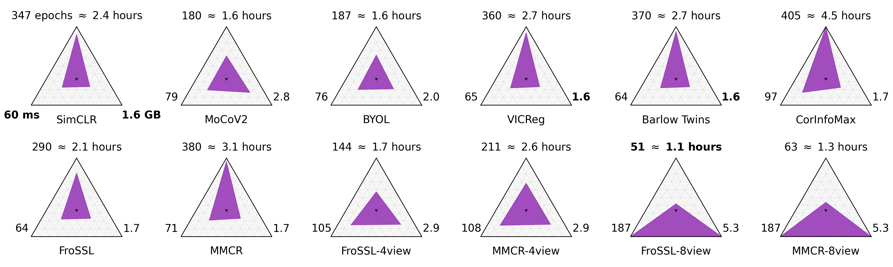
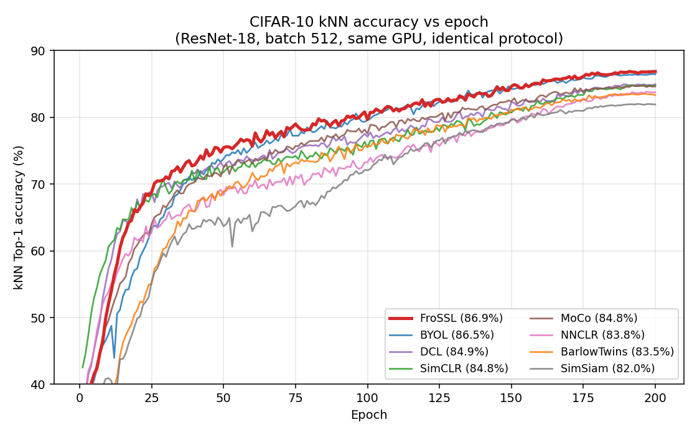
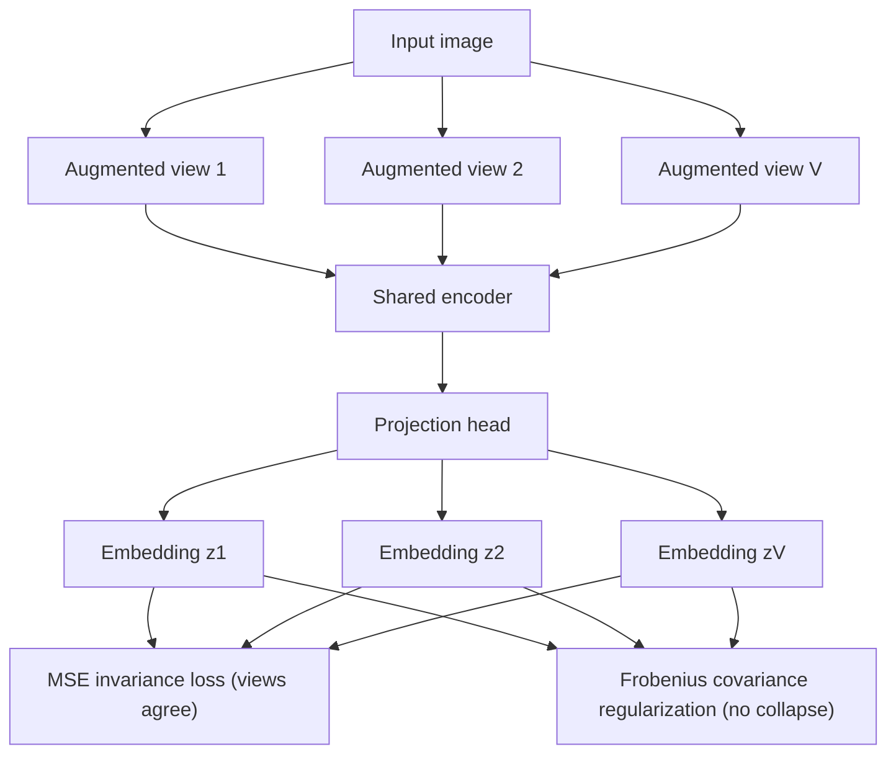

# FroSSL: Frobenius Norm Minimization for Efficient Multiview Self-Supervised Learning

[](https://arxiv.org/abs/2310.02903)
[](https://arxiv.org/abs/2310.02903)
[](https://opensource.org/licenses/MIT)
[](https://www.python.org/downloads/)
[](https://pytorch.org/)

**FroSSL is a self-supervised learning (SSL) objective for efficient multiview representation learning.** It combines covariance regularization with multiview training while avoiding expensive eigendecomposition, letting you reach strong representations *faster* without sacrificing quality. The objective is simple: mean-squared error for augmentation invariance plus a Frobenius-norm covariance term to prevent collapse. FroSSL is also available in [lightly](https://github.com/lightly-ai/lightly) as `FroSSLLoss`.

If you are looking for an SSL baseline that is easy to understand, cheap to train, and scales naturally to many augmented views, FroSSL is designed for you.

## Why use FroSSL?

- **Computationally efficient covariance regularization** — no eigendecomposition, so per-step cost stays low even as you add views. See [Faster convergence](#faster-convergence).
- **Naturally supports multiview SSL** — designed from the start for more than two views. See [Why multiview matters](#why-multiview-matters).
- **Faster convergence than competing SSL objectives** — reaches a target accuracy in fewer epochs and less wall-clock time. See [Faster convergence](#faster-convergence).
- **Simple objective** — just MSE invariance + Frobenius covariance regularization ([~30 lines of code](solo/losses/frossl.py)). See [Method overview](#method-overview).
- **Competitive linear-probe accuracy** across standard benchmarks (STL-10, Tiny ImageNet, ImageNet-100). See [Results](#results).

### How does it compare?

The goal of this table is not to claim FroSSL wins everywhere — it is to help you see where FroSSL fits among common baselines.

| Method       | Family              | Negative pairs | Momentum encoder | Eigendecomposition | Multiview-friendly |
|--------------|---------------------|:--------------:|:----------------:|:------------------:|:------------------:|
| SimCLR       | Sample-contrastive  | Yes            | No               | No                 | Limited            |
| BYOL         | Asymmetric          | No             | Yes              | No                 | Moderate           |
| Barlow Twins | Dimension-contrastive | No           | No               | No                 | Moderate           |
| VICReg       | Dimension-contrastive | No           | No               | No                 | Moderate           |
| W-MSE        | Dimension-contrastive | No           | No               | Yes (whitening)    | Limited            |
| **FroSSL**   | Dimension-contrastive | **No**       | **No**           | **No**             | **Yes**            |

Want the details? See [`docs/WHY_FROSSL.md`](docs/WHY_FROSSL.md) for a deeper comparison of the math, tradeoffs, and evidence against SimCLR, BYOL, VICReg, and Barlow Twins.

## Faster convergence

FroSSL's central contribution is **optimization efficiency**: it is designed to reach strong representations in *fewer training epochs*, reducing overall training cost. The figure below reports the number of epochs (and wall-clock time) each method needs to reach a target STL-10 accuracy, along with per-step memory and batch time.



FroSSL is efficient with two views and gets *even more efficient with more views* — the 8-view configuration reaches the target in the fewest epochs and least wall-clock time of any method compared. Because the objective avoids eigendecomposition, adding views stays cheap. The paper provides theoretical and empirical support that this faster convergence comes from how FroSSL shapes the eigenvalues of the embedding covariance matrices — without ever computing them.

## Why multiview matters

Increasing the number of augmented views often improves SSL optimization, but many covariance-based objectives become expensive in this setting because their regularizers rely on eigendecomposition, which scales poorly with the number of views. FroSSL was designed specifically to make **multiview covariance regularization practical**: the Frobenius-norm term is cheap to compute per view, so training on 4 or 8 views is a straightforward configuration change rather than a computational burden.

## Quick Start

```bash
# 1. Clone
git clone https://github.com/OFSkean/FroSSL.git
cd FroSSL

# 2. Install (Python 3.10 recommended)
conda create -n frossl python=3.10 && conda activate frossl
pip install -r requirements.txt

# 3. Train FroSSL on CIFAR-10 (downloads data automatically)
bash run_cifar10.sh
```

That's it — `run_cifar10.sh` pretrains a ResNet-18 with FroSSL and then trains a linear probe. Metrics are logged to [Weights & Biases](https://wandb.ai/) (make sure you are logged in via `wandb login`).

## Installation

```bash
git clone https://github.com/OFSkean/FroSSL.git
cd FroSSL

conda create -n frossl python=3.10
conda activate frossl

pip install -r requirements.txt
```

FroSSL builds on the excellent [solo-learn](https://github.com/vturrisi/solo-learn) library. FroSSL is also available in [lightly](https://github.com/lightly-ai/lightly) as `FroSSLLoss`.

### Datasets

CIFAR-10, CIFAR-100, and STL-10 download automatically via PyTorch. Other datasets need a little setup. By default data lives in `./datasets/{dataset-name}`; change this in the config files under `scripts/pretrain/*`.

- **Tiny ImageNet**: `cd scripts/utils/tiny-imagenet && ./downloader.sh`
- **ImageNet**: follow [this guide](https://cloud.google.com/tpu/docs/imagenet-setup#download-dataset). Required to build ImageNet-100.
- **ImageNet-100**: `python make_imagenet100.py full/imagenet/path desired/imagenet100/path`

## Training examples

Each dataset and method has its own config under `scripts/pretrain/`. By default these match the paper's settings. Training logs to Weights & Biases, so run `wandb login` first.

```bash
# Pretrain + linear probe in one shot: <experiment_name> <dataset> <method> <num_views>
./pretrain_then_linear.sh frossl-cifar10       cifar10       frossl 2
./pretrain_then_linear.sh frossl-imagenet100   imagenet100   frossl 2
./pretrain_then_linear.sh frossl-tiny-imagenet tiny-imagenet frossl 2
```

Convenience wrappers are also provided: `bash run_cifar10.sh`, `bash run_imagenet100.sh`, `bash run_tiny.sh`.

To tweak hyperparameters, augmentations, or the loss, edit the relevant YAML, e.g. `scripts/pretrain/cifar/frossl.yaml`.

### Using FroSSL on your own dataset

FroSSL works on any image dataset with no code changes — just point a config at your data. Copy an existing config and edit the `data` block:

```yaml
# scripts/pretrain/custom/frossl.yaml
method: "frossl"
backbone:
  name: "resnet18"
method_kwargs:
  proj_hidden_dim: 2048
  proj_output_dim: 1024
  kernel_type: "linear"
  invariance_weight: 1.0
data:
  dataset: "custom"
  train_path: "PATH_TO_TRAIN_DIR"   # ImageFolder layout: train/<class>/<image>.jpg
  val_path: "PATH_TO_VAL_DIR"       # remove if you have no validation split
  format: "image_folder"
  no_labels: True                   # set True if images are not in per-class subfolders
```

Then launch:

```bash
python3 -u main_pretrain.py --config-path scripts/pretrain/custom --config-name frossl.yaml
```

To use more views, increase the number of crops in the augmentation config (`scripts/pretrain/custom/augmentations/`). This is where FroSSL's efficiency advantage grows.

## Results

**Takeaway:** FroSSL learns representations of competitive quality while consistently reaching a target accuracy in *fewer training epochs* than other SSL objectives, and its advantage widens as more views are added. In the paper, FroSSL trains a ResNet-18 to competitive linear-probe accuracy on STL-10, Tiny ImageNet, and ImageNet-100.

See the [FroSSL paper](https://arxiv.org/abs/2310.02903) for the full linear-probe tables, convergence curves, and ablations.

### Reproducible CIFAR-10 comparison

As an independent check while adding FroSSL to [lightly](https://github.com/lightly-ai/lightly), we ran it through lightly's CIFAR-10 kNN benchmark against seven common SSL methods **under an identical protocol on the same GPU** (ResNet-18, batch size 512, 200 epochs, kNN with k=200). This is a two-view configuration — FroSSL's advantage grows further with more views (see [Faster convergence](#faster-convergence)).

| Method | kNN Top-1 | Runtime | Peak GPU |
|--------------|:---------:|:-------:|:--------:|
| **FroSSL**   | **86.9%** | 52.1 min | 4.83 GB |
| BYOL         | 86.5%     | 62.5 min | 5.43 GB |
| DCL          | 85.0%     | 51.9 min | 4.85 GB |
| SimCLR       | 84.8%     | 51.6 min | 4.85 GB |
| MoCo         | 84.8%     | 64.9 min | 5.53 GB |
| NNCLR        | 83.8%     | 52.8 min | 4.96 GB |
| Barlow Twins | 83.5%     | 51.8 min | 4.96 GB |
| SimSiam      | 82.0%     | 52.1 min | 4.97 GB |

FroSSL reaches the **highest kNN accuracy**, at the **lowest peak memory** and in the fastest tier of runtimes (the momentum-encoder methods BYOL and MoCo are noticeably slower). It is also the fastest to converge: it matches every other method's *final* 200-epoch accuracy in fewer epochs — e.g. Barlow Twins' best by epoch 138 and SimCLR's by epoch 151 — then continues to improve.



<sub>Single seed. kNN accuracy is hardware-independent; runtime and peak memory were measured on one NVIDIA RTX 4090 and are comparable within this run. Per-epoch data: [`experiments/lightly_cifar10/cifar10_knn_curves.csv`](experiments/lightly_cifar10/cifar10_knn_curves.csv).</sub>

## Method overview

FroSSL trains an encoder so that different augmented views of the same image map to similar embeddings (invariance), while keeping each view's embedding dimensions decorrelated and informative (regularization) to avoid collapse.



The full objective is `L = MSE(views) + Frobenius-norm covariance regularization`. Concretely, for each view the covariance (or Gram) matrix is formed and its (negative log) Frobenius norm is minimized — an eigendecomposition-free way to encourage a well-spread eigenvalue spectrum. See equations (3) and (6) in the paper.

- Loss implementation: [`solo/losses/frossl.py`](solo/losses/frossl.py)
- Method / training step: [`solo/methods/frossl.py`](solo/methods/frossl.py)
- Deeper comparison and intuition: [`docs/WHY_FROSSL.md`](docs/WHY_FROSSL.md)

## Citation

If you find FroSSL useful, please cite:

```bibtex
@inproceedings{skean2024frossl,
  title={FroSSL: Frobenius Norm Minimization for Self-Supervised Learning},
  author={Skean, Oscar and Dhakal, Aayush and Jacobs, Nathan and Giraldo, Luis Gonzalo Sanchez},
  booktitle={European Conference on Computer Vision (ECCV)},
  year={2024}
}
```

## Let us know

Please [open an issue](https://github.com/OFSkean/FroSSL/issues) if you hit any errors or difficulties. We are happy to help resolve issues or answer questions.

## Acknowledgements

This implementation started as a fork of the fantastic [solo-learn](https://github.com/vturrisi/solo-learn) library, and is distributed under the MIT license.
